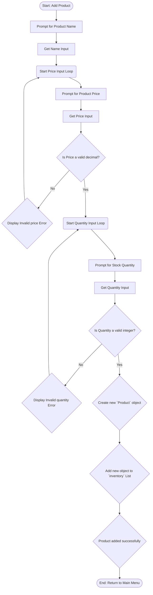

```mermaid
graph TD
    A([Start: Add Product]) --> B[Prompt for Product Name];
    B --> C[Get Name Input];
    
    C --> D_LoopStart(Start Price Input Loop);
    D_LoopStart --> D[Prompt for Product Price];
    D --> E[Get Price Input];
    E --> F{Is Price a valid decimal?};
    F -- No --> G{Display Invalid price Error};
    G --> D_LoopStart;
    
    F -- Yes --> H_LoopStart(Start Quantity Input Loop);
    H_LoopStart --> H[Prompt for Stock Quantity];
    H --> I[Get Quantity Input];
    I --> J{Is Quantity a valid integer?};
    J -- No --> K{Display Invalid quantity Error};
    K --> H_LoopStart;

    J -- Yes --> L{Create new `Product` object};
    L --> M{Add new object to `inventory` List};
    M --> N{"Product added successfully"};
    N --> O([End: Return to Main Menu]);
```