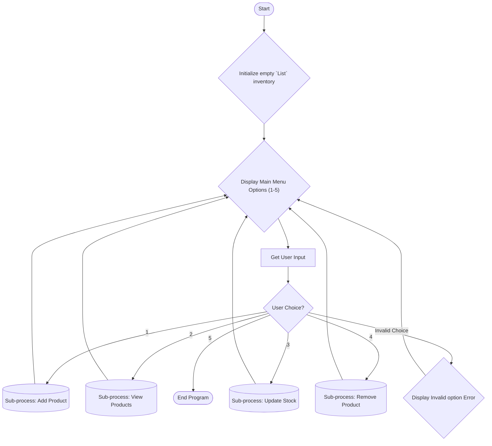

# My Application Flowchart

Here is the process flow for the inventory management system.

# My Application Flowchart

Here is the process flow for the inventory management system.

```mermaid
graph TD
    A([Start]) --> B{Initialize empty `List<Product>` inventory};
    B --> C{"Display Main Menu Options (1-5)"};
    C --> D[Get User Input];
    D --> E{User Choice?};

    E -- 1 --> F[(Sub-process: Add Product)];
    F --> C;

    E -- 2 --> G[(Sub-process: View Products)];
    G --> C;

    E -- 3 --> H[(Sub-process: Update Stock)];
    H --> C;

    E -- 4 --> I[(Sub-process: Remove Product)];
    I --> C;
    
    E -- 5 --> J([End Program]);

    E -- Invalid Choice --> K{"Display Invalid option Error"};
    K --> C;
```