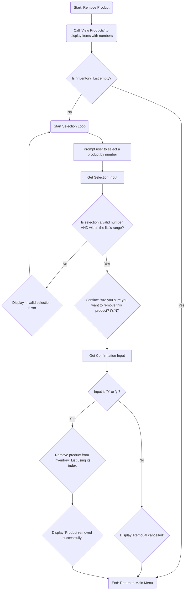

```mermaid
graph TD
    A("Start: Remove Product") --> B("Call 'View Products' to display items with numbers");
    B --> C{"Is `inventory` List empty?"};
    C -- Yes --> Z("End: Return to Main Menu");

    C -- No --> D_LoopStart(Start Selection Loop);
    D_LoopStart --> D[Prompt user to select a product by number];
    D --> E[Get Selection Input];
    E --> F{"Is selection a valid number AND within the list's range?"};
    
    F -- No --> G{"Display 'Invalid selection' Error"};
    G --> D_LoopStart;
    
    F -- Yes --> H{"Confirm: 'Are you sure you want to remove this product? (Y/N)'"};
    H --> I[Get Confirmation Input];
    I --> J{"Input is 'Y' or 'y'?"};
    
    J -- No --> K{"Display 'Removal cancelled'"};
    K --> Z;
    
    J -- Yes --> L{"Remove product from `inventory` List using its index"};
    L --> M{"Display 'Product removed successfully'"};
    M --> Z;
```