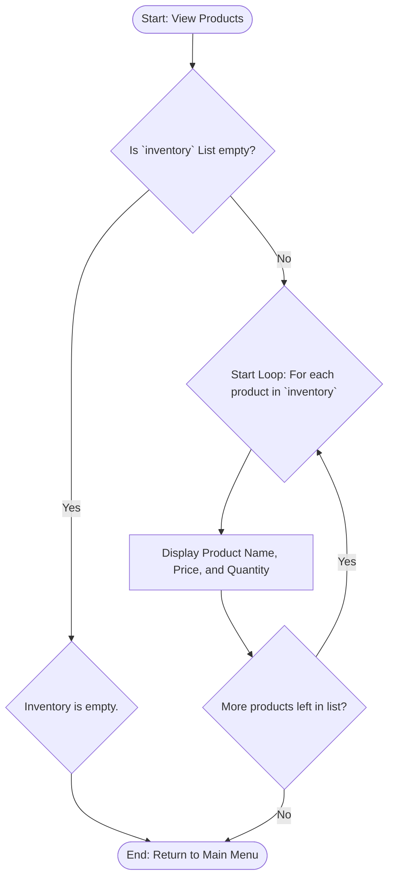

```mermaid
graph TD
    A([Start: View Products]) --> B{Is `inventory` List empty?};
    B -- Yes --> C{"Inventory is empty."};
    C --> G([End: Return to Main Menu]);
    
    B -- No --> D{Start Loop: For each product in `inventory`};
    D --> E[Display Product Name, Price, and Quantity];
    E --> F{More products left in list?};
    F -- Yes --> D;
    F -- No --> G;
```