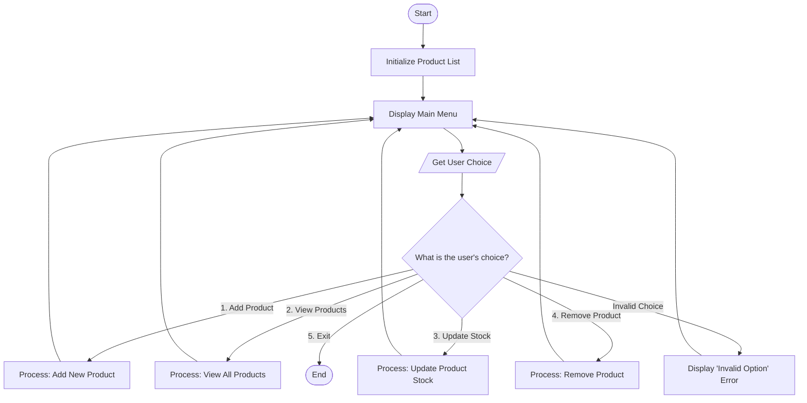

```mermaid
graph TD
    A([Start]) --> B[Initialize Product List];
    B --> C_Loop[Display Main Menu];
    C_Loop --> D[/Get User Choice/];
    D --> E{"What is the user's choice?"};

    E -- 1. Add Product --> F["Process: Add New Product"];
    F --> C_Loop;

    E -- 2. View Products --> G["Process: View All Products"];
    G --> C_Loop;

    E -- 3. Update Stock --> H["Process: Update Product Stock"];
    H --> C_Loop;

    E -- 4. Remove Product --> I["Process: Remove Product"];
    I --> C_Loop;

    E -- 5. Exit --> J([End]);

    E -- Invalid Choice --> K["Display 'Invalid Option' Error"];
    K --> C_Loop;
```